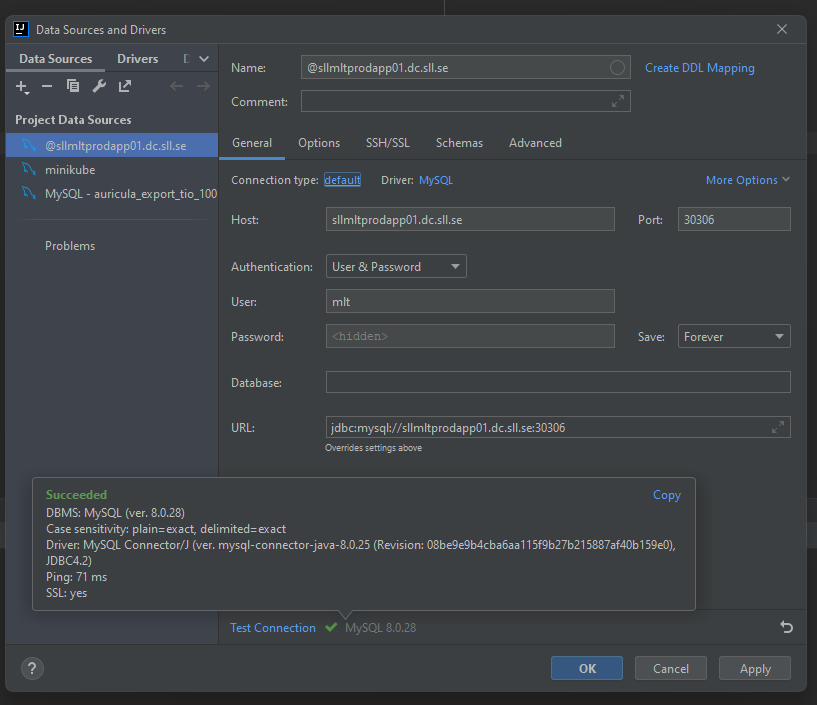
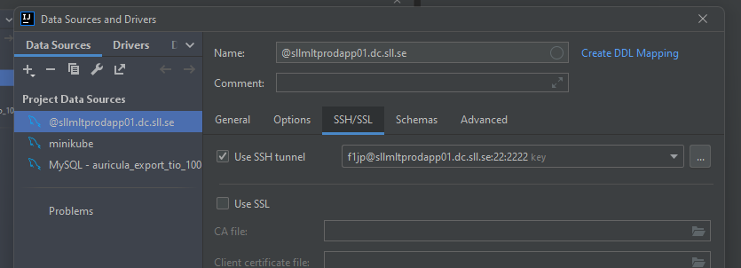
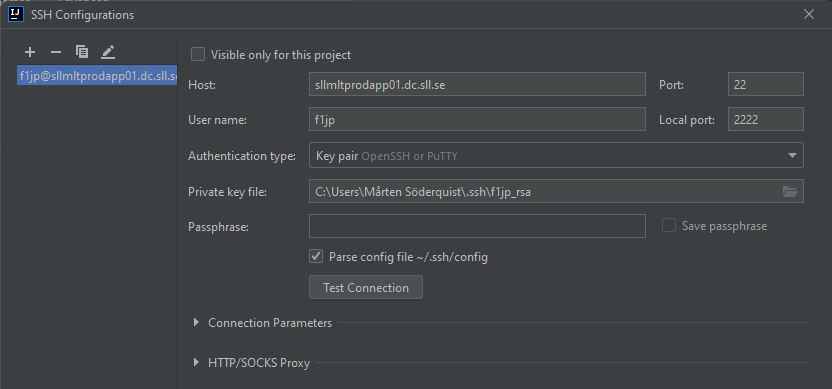

# MYSQL

Kubernetes-definitioner för starta en MySQL-server i klustret.

## Komma åt MySQL CLI på klustret

- Logga in på klustrets masternod, sllmltprodapp01.dc.sll.se
- Logga in i podden med `kubectl exec -it mysql-auricula-0 -n auricula -- bash`
- Det startar `bash` som root i podden med MySQL. Nu kan man köra CLI verktygen direkt mot
databasen.

## Ansluta till databasen från IntelliJ
host: sllmltprodapp01.dc.sll.se\
port: 30306\
user: mlt\

## Tunnla SSH i IntelliJ
För att kunna ansluta till klustret behöver man SSH-tunnla eftersom 
porten 30306 inte är öppen utåt. För att det ska fungera måste man konfigurera
nyckeln. Konfigurationsdialogen öppnas med knappen med tre punkter längst till höger 
på samma rad som "Use SSH tunnel". 

### Konfig av SSH-nyckel
Exempel på hur konfigurationen av SSH-nyckeln kan se ut.

